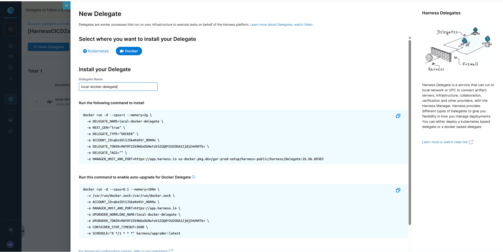

# 🚀 Deploy Python App with Local Docker Runner

## What We Built

```
python-project/
├── app.py              ← Flask web app
├── test_app.py         ← Unit tests
├── requirements.txt    ← Dependencies
├── Dockerfile          ← Docker image
├── .gitignore
└── .harness/
    └── pipeline-docker.yaml  ← Harness pipeline (Local Docker)
```

---

## Prerequisites

1. Docker Desktop installed and running
2. Harness Delegate installed (see below)
3. Code pushed to GitHub

---

## Step 1: Install Harness Docker Delegate on Your Laptop

**Prerequisites:** Docker Desktop must be installed and running on your laptop.

**Download Docker Desktop (if not installed):**
- Go to: https://www.docker.com/products/docker-desktop
- Download for Windows
- Install and restart laptop
- Open Docker Desktop → make sure it shows "Docker is running" (green)

**Screenshots:**




**Now install the Delegate:**

1. Go to Harness → Project Settings → Delegates
2. Click **+ New Delegate**
3. Choose **Docker**
4. Fill in:
   - Delegate Name: `local-docker-delegate`
   - Delegate Tags: `linux-amd64` (IMPORTANT! Without this tag, pipeline won't work)
5. Copy the `docker run` command Harness shows
6. Before running, make sure `DELEGATE_TAGS="linux-amd64"` is in the command
7. Open terminal (Git Bash or PowerShell) on your laptop
8. Run the delegate command (example):
   ```
   docker run -d --cpus=1 --memory=2g \
     -e DELEGATE_NAME=local-docker-delegate \
     -e NEXT_GEN="true" \
     -e DELEGATE_TYPE="DOCKER" \
     -e ACCOUNT_ID=YOUR_ACCOUNT_ID \
     -e DELEGATE_TOKEN=YOUR_TOKEN \
     -e DELEGATE_TAGS="linux-amd64" \
     -e MANAGER_HOST_AND_PORT=https://app.harness.io \
     us-docker.pkg.dev/gar-prod-setup/harness-public/harness/delegate:latest
   ```
9. Run the auto-upgrade command (use `//var` for Git Bash on Windows):
   ```
   docker run -d --cpus=0.1 --memory=100m \
     -v //var/run/docker.sock:/var/run/docker.sock \
     -e ACCOUNT_ID=YOUR_ACCOUNT_ID \
     -e MANAGER_HOST_AND_PORT=https://app.harness.io \
     -e UPGRADER_WORKLOAD_NAME=local-docker-delegate \
     -e UPGRADER_TOKEN=YOUR_TOKEN \
     -e CONTAINER_STOP_TIMEOUT=3600 \
     -e SCHEDULE="0 */1 * * *" harness/upgrader:latest
   ```
10. Wait 2-3 minutes
11. Go back to Harness UI → Delegates page
12. You should see: `local-docker-delegate` with tags: `local-docker-delegate, linux-amd64` → Status: **Connected** ✅

**Windows Git Bash note:** Use `//var/run/docker.sock` (double slash) instead of `/var/run/docker.sock`

**Verify it's running:**
```
docker ps
```
You should see a container named `harness-ng-delegate` running.

**If it fails:**
- Make sure Docker Desktop is running (check system tray icon)
- Make sure you have internet connection
- Try: `docker compose -f docker-compose.yml down` then `up -d` again
- Check logs: `docker logs harness-ng-delegate`

---

## Step 2: Push Code to GitHub

```bash
git add .
git commit -m "Episode 2: Python project with Docker pipeline"
git push origin master
```

---

## Step 3: Create Pipeline in Harness

1. Pipelines → Import from Git
2. Connector: your GitHub connector
3. Repo: Harness-CI-CD-Zero-to-Hero
4. Branch: master
5. YAML Path: Episode-02/python-project/.harness/pipeline-docker.yaml
6. Click Import

---

## Step 4: Run Pipeline

1. Click Run
2. Branch: master
3. Click Run Pipeline
4. Watch 3 steps execute:
   - Install Dependencies ✅
   - Run Tests ✅
   - Run App ✅

---

## Expected Output

```
=== Running Unit Tests ===
test_app.py::test_home PASSED
test_app.py::test_health PASSED
test_app.py::test_info PASSED
=== All Tests Passed! ===

=== Starting Python App ===
{'message': 'Hello from Harness CI/CD Course!', 'episode': 2, ...}
{'status': 'healthy'}
=== App Works! Pipeline Success! ===
```

---

## Run Locally (to test before pushing)

```bash
cd Episode-02/python-project
pip install -r requirements.txt
pytest test_app.py -v
python app.py
# Open browser: http://localhost:5000
```
